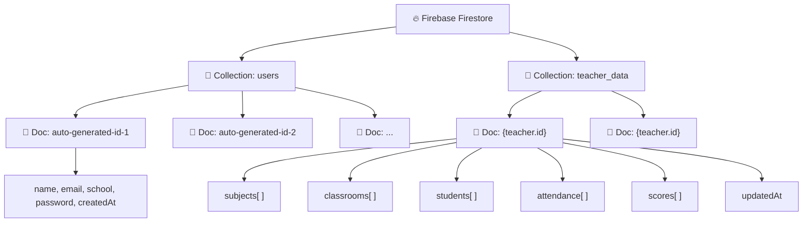
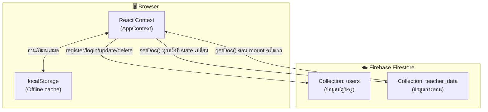

# 📋 สรุปโปรเจ็ค Teacher Management System (ฉบับสมบูรณ์)

> อัปเดตล่าสุด: 20 กรกฎาคม 2026

---

## 🏗️ ภาพรวมโปรเจ็ค

**ชื่อ**: Teacher Management System — ระบบจัดการชั้นเรียนสำหรับครูผู้สอน

**วัตถุประสงค์**: ให้ครูสามารถจัดการวิชา, ห้องเรียน, นักเรียน, เช็คชื่อ, บันทึกคะแนน และดูสถิติ ทั้งหมดจากเว็บเดียว

**ภาษาที่รองรับ**: 🇹🇭 ไทย (ค่าเริ่มต้น) / 🇬🇧 อังกฤษ — สลับได้ทั้งเว็บ

---

## 🛠️ Tech Stack

### Core Framework
| เทคโนโลยี | เวอร์ชัน | ทำหน้าที่ |
|---|---|---|
| [Next.js](https://nextjs.org) | `16.2.10` | Full-stack React framework (App Router) |
| [React](https://react.dev) | `19.2.4` | UI component library |
| [TypeScript](https://www.typescriptlang.org) | `^5` | Type safety สำหรับ JavaScript |

### Styling & UI
| เทคโนโลยี | เวอร์ชัน | ทำหน้าที่ |
|---|---|---|
| [TailwindCSS](https://tailwindcss.com) | `^4` | Utility-first CSS framework |
| [shadcn/ui](https://ui.shadcn.com) | `^4.13.0` | Pre-built UI components (24 components) |
| [Lucide React](https://lucide.dev) | `^1.23.0` | Icon library |
| [React Icons](https://react-icons.github.io) | `^5.7.0` | Additional icons |
| [tw-animate-css](https://github.com/nichealpham/tw-animate-css) | `^1.4.0` | TailwindCSS animation utilities |
| [next-themes](https://github.com/pacocoursey/next-themes) | `^0.4.6` | Dark/Light mode support |

### Database & Backend
| เทคโนโลยี | เวอร์ชัน | ทำหน้าที่ |
|---|---|---|
| [Firebase Firestore](https://firebase.google.com/docs/firestore) | `^12.16.0` | Cloud NoSQL Database |

### Forms & Validation
| เทคโนโลยี | เวอร์ชัน | ทำหน้าที่ |
|---|---|---|
| [React Hook Form](https://react-hook-form.com) | `^7.81.0` | Form state management |
| [Zod](https://zod.dev) | `^4.4.3` | Schema validation (ใช้ใน Register form) |
| [@hookform/resolvers](https://github.com/react-hook-form/resolvers) | `^5.4.0` | Zod ↔ React Hook Form bridge |

### Data Display & Export
| เทคโนโลยี | เวอร์ชัน | ทำหน้าที่ |
|---|---|---|
| [Recharts](https://recharts.org) | `^3.9.2` | Charts & Graphs (Pie charts ในหน้าสถิติ) |
| [@tanstack/react-table](https://tanstack.com/table) | `^8.21.3` | Data table management |
| [xlsx](https://sheetjs.com) | `^0.18.5` | Excel import/export |
| [date-fns](https://date-fns.org) | `^4.4.0` | Date utilities |
| [react-day-picker](https://daypicker.dev) | `^10.0.1` | Calendar/Date picker |

### UI Utilities
| เทคโนโลยี | เวอร์ชัน | ทำหน้าที่ |
|---|---|---|
| [sonner](https://sonner.emilkowal.ski) | `^2.0.7` | Toast notifications |
| [cmdk](https://cmdk.paco.me) | `^1.1.1` | Command palette |
| [class-variance-authority](https://cva.style) | `^0.7.1` | Component variant management |
| [clsx](https://github.com/lukeed/clsx) | `^2.1.1` | Conditional classNames |
| [tailwind-merge](https://github.com/dcastil/tailwind-merge) | `^3.6.0` | Merge TailwindCSS classes |

---

## 📄 รายละเอียดแต่ละหน้า

### 1. 🏠 Landing Page — `/`
**ไฟล์**: [app/page.tsx](file:///Users/ice/teacher-management-systems/app/page.tsx)

| รายการ | รายละเอียด |
|---|---|
| **แสดง** | Navbar, Hero Section (ชื่อแอป + CTA), Features Section (3 cards), Footer |
| **Components ที่ใช้** | `Navbar`, `HeroSection`, `FeaturesSection`, `Footer` |
| **Data** | ไม่มี (static content) |
| **User Actions** | ดูข้อมูลแอป, ไปหน้า Login / Register |

---

### 2. 🔐 Login Page — `/login`
**ไฟล์**: [app/(auth)/login/page.tsx](file:///Users/ice/teacher-management-systems/app/(auth)/login/page.tsx)

| รายการ | รายละเอียด |
|---|---|
| **แสดง** | ฟอร์ม Email + Password, ปุ่ม Login, Error message, ลิงก์ไป Register |
| **Data** | เรียก `loginTeacher()` → ค้นหาจาก **Firestore `users` collection** |
| **User Actions** | กรอก email + password → Login → redirect ไป Dashboard |
| **Validation** | เช็คว่ากรอกครบหรือยัง |

---

### 3. 📝 Register Page — `/register`
**ไฟล์**: [app/(auth)/register/page.tsx](file:///Users/ice/teacher-management-systems/app/(auth)/register/page.tsx)

| รายการ | รายละเอียด |
|---|---|
| **แสดง** | ฟอร์ม ชื่อ + โรงเรียน + Email + Password, Success/Error banners |
| **Data** | เรียก `registerTeacher()` → เขียนลง **Firestore `users` collection** |
| **User Actions** | กรอกข้อมูล → สมัครสมาชิก → redirect ไป Login |
| **Validation** | Zod schema (ชื่อ ≥2 ตัว, email valid, password ≥6 ตัว) + error messages 2 ภาษา |

---

### 4. 📊 Dashboard Page — `/dashboard`
**ไฟล์**: [app/(dashboard)/dashboard/page.tsx](file:///Users/ice/teacher-management-systems/app/(dashboard)/dashboard/page.tsx)

| รายการ | รายละเอียด |
|---|---|
| **แสดง** | Welcome Banner, Stats Cards (3 ใบ), Subject List, Quick Menu |
| **Components ที่ใช้** | `WelcomeBanner`, `DashboardStats`, `SubjectsList`, `QuickMenu` |
| **Data** | กรองวิชา/ห้องเรียน/นักเรียนของครูคนปัจจุบัน |
| **User Actions** | ดูภาพรวม, คลิก Quick Links ไปหน้าต่างๆ |

**Components ย่อย:**

| Component | ทำหน้าที่ |
|---|---|
| [welcome-banner.tsx](file:///Users/ice/teacher-management-systems/components/dashboard/welcome-banner.tsx) | แสดง badge "Welcome back" + ชื่อครู |
| [stats-cards.tsx](file:///Users/ice/teacher-management-systems/components/dashboard/stats-cards.tsx) | แสดง 3 cards: จำนวนวิชา, ห้องเรียน, นักเรียน |
| [subjects-list.tsx](file:///Users/ice/teacher-management-systems/components/dashboard/subjects-list.tsx) | แสดงรายการวิชาพร้อม badge ห้องเรียน |
| [quick-menu.tsx](file:///Users/ice/teacher-management-systems/components/dashboard/quick-menu.tsx) | เมนูลัด 3 ปุ่ม: จัดการวิชา, เช็คชื่อ, คะแนน |

---

### 5. 📚 Subjects Page — `/subjects` ⭐ หน้าหลักสำคัญที่สุด
**ไฟล์**: [app/(dashboard)/subjects/page.tsx](file:///Users/ice/teacher-management-systems/app/(dashboard)/subjects/page.tsx)

| รายการ | รายละเอียด |
|---|---|
| **แสดง** | ปุ่ม "เพิ่มวิชา" + Grid ของ SubjectCards + Dialogs |
| **Components ที่ใช้** | `SubjectCard`, `AddSubjectDialog`, `AddClassroomDialog` |
| **Data** | จัดการ Subjects + Classrooms |
| **User Actions** | เพิ่ม/แก้ไข/ลบวิชา, เพิ่ม/ลบห้องเรียน, เข้าดูรายละเอียดห้องเรียน |

**Components ย่อย:**

| Component | ทำหน้าที่ |
|---|---|
| [subject-card.tsx](file:///Users/ice/teacher-management-systems/components/subjects/subject-card.tsx) | Card แสดงวิชา: รหัส, ชั้น, ชื่อ, รายการห้องเรียน, ปุ่มแก้ไข/ลบ |
| [add-subject-dialog.tsx](file:///Users/ice/teacher-management-systems/components/subjects/add-subject-dialog.tsx) | Dialog เพิ่ม/แก้ไขวิชา: รหัสวิชา, ชื่อ, ระดับชั้น (ป.1–ม.6) |
| [add-classroom-dialog.tsx](file:///Users/ice/teacher-management-systems/components/subjects/add-classroom-dialog.tsx) | Dialog เพิ่มห้องเรียนใหม่: ชื่อห้อง, คำอธิบาย |

---

### 6. 🏫 Classroom Detail (ซ่อนอยู่ใน Subject Card — เปิดเมื่อคลิกเข้าห้องเรียน)

เมื่อคลิกเข้าห้องเรียน จะแสดง **6 Tabs** ภายในหน้า Subjects:

| Tab | Component | ทำหน้าที่ |
|---|---|---|
| 👨‍🎓 **นักเรียน** | [students-tab.tsx](file:///Users/ice/teacher-management-systems/components/classrooms/students-tab.tsx) | ตารางนักเรียน: เพิ่ม/แก้ไข/ลบ + Import/Export Excel |
| ✅ **เช็คชื่อ** | [attendance-tab.tsx](file:///Users/ice/teacher-management-systems/components/classrooms/attendance-tab.tsx) | เลือกวัน → เช็คชื่อรายคน (มาเรียน/สาย/ขาด + เหตุผล) → บันทึก |
| 📊 **คะแนน** | [scores-tab.tsx](file:///Users/ice/teacher-management-systems/components/classrooms/scores-tab.tsx) | เพิ่มบท/ข้อสอบ → กรอกคะแนนรายคน → แสดง ผ่าน/ไม่ผ่าน |
| 📈 **เกรด** | [grades-tab.tsx](file:///Users/ice/teacher-management-systems/components/classrooms/grades-tab.tsx) | คำนวณเกรดอัตโนมัติ (4.0→0) + ตั้งเกณฑ์เกรด + กรองตามเทอม + Export Excel |
| 📅 **ประวัติ** | [history-tab.tsx](file:///Users/ice/teacher-management-systems/components/classrooms/history-tab.tsx) | สถิติเช็คชื่อ: นร.เสี่ยง, Pie chart รายเดือน, log รายวัน |
| ℹ️ **ข้อมูล** | [info-tab.tsx](file:///Users/ice/teacher-management-systems/components/classrooms/info-tab.tsx) | แสดงข้อมูลห้อง: ชื่อ, วิชา, คำอธิบาย, จำนวน นร./บท |

---

### 7. 👤 Profile Page — `/profile`
**ไฟล์**: [app/(dashboard)/profile/page.tsx](file:///Users/ice/teacher-management-systems/app/(dashboard)/profile/page.tsx)

| รายการ | รายละเอียด |
|---|---|
| **แสดง** | รูป Avatar (อัปโหลด/ลบได้) + ฟอร์มแก้ไข ชื่อ, Email, โรงเรียน |
| **Data** | เรียก `updateProfile()` → อัปเดตใน **Firestore `users` collection** |
| **User Actions** | แก้ไขข้อมูลส่วนตัว, อัปโหลดรูป (จำกัด 1MB), ลบรูป |

---

### 8. 🛡️ Admin Panel — `/admin`
**ไฟล์**: [app/admin/page.tsx](file:///Users/ice/teacher-management-systems/app/admin/page.tsx)

| รายการ | รายละเอียด |
|---|---|
| **แสดง** | Header + สลับภาษา, 4 Stat Cards, ตารางรายชื่อครูทั้งหมด |
| **Data** | อ่านครูทั้งหมดจาก **Firestore `users` collection** |
| **User Actions** | ดูรายชื่อครู, ลบครูออกจากระบบ (ban), ล้าง Orphaned Data |

**4 Stat Cards:**
| Card | แสดง |
|---|---|
| 👩‍🏫 คุณครูสะสม | จำนวนครูทั้งหมดจาก Firestore |
| 📚 วิชาทั้งหมด | จำนวนวิชาในระบบ + ปุ่มล้างวิชาตกค้าง |
| 🏫 ห้องเรียน | จำนวนห้องเรียนทั้งหมด |
| 👨‍🎓 นักเรียนรวม | จำนวนนักเรียนทั้งหมด |

---

### 9. 🔀 หน้า Redirect (ไม่มี UI เป็นของตัวเอง)

| เส้นทาง | Redirect ไป | เหตุผล |
|---|---|---|
| `/classrooms` | → `/subjects` | ห้องเรียนจัดการอยู่ในหน้า Subjects |
| `/students` | → `/subjects` | นักเรียนจัดการอยู่ใน Tab ของห้องเรียน |
| `/attendance` | → `/subjects` | เช็คชื่ออยู่ใน Tab ของห้องเรียน |
| `/scores` | → `/subjects` | คะแนนอยู่ใน Tab ของห้องเรียน |
| `/settings` | → `/profile` | ตั้งค่าอยู่ในหน้า Profile |

---

## 🗄️ Database (Firebase Firestore)

### สถาปัตยกรรมภาพรวม



---

### Collection 1: `users` — ข้อมูลบัญชีครู

> ใช้สำหรับ **Authentication** (Login / Register / Profile / Admin)

| Field | Type | คำอธิบาย |
|---|---|---|
| *Document ID* | string | สร้างอัตโนมัติโดย Firestore (`addDoc`) |
| `name` | string | ชื่อครู |
| `email` | string | อีเมล (ใช้เป็น unique key) |
| `school` | string | โรงเรียน |
| `password` | string | รหัสผ่าน (plaintext) |
| `avatar?` | string | URL รูปโปรไฟล์ (optional) |
| `createdAt` | string (ISO) | วันที่สมัคร |

**Operations:**

| Operation | Function | ที่ไหน |
|---|---|---|
| **Create** | `registerTeacher()` | AppContext → `addDoc(users)` |
| **Read** | `loginTeacher()` | AppContext → `query(users, email+password)` |
| **Read All** | `getDocs(users)` | Admin Page → แสดงรายชื่อครูทั้งหมด |
| **Update** | `updateProfile()` | AppContext → `updateDoc(users/{id})` |
| **Delete** | `deleteTeacher()` | AppContext → `deleteDoc(users/{id})` |

---

### Collection 2: `teacher_data` — ข้อมูลการสอนของครูแต่ละคน

> ใช้สำหรับ **Sync ข้อมูลวิชา/ห้องเรียน/นักเรียน/เช็คชื่อ/คะแนน** ไปยัง Cloud

| Field | Type | คำอธิบาย |
|---|---|---|
| *Document ID* | string | ตรงกับ `teacher.id` (= document ID จาก `users` collection) |
| `subjects` | Array\<Subject\> | รายการวิชาทั้งหมดของครู |
| `classrooms` | Array\<Classroom\> | รายการห้องเรียนทั้งหมด |
| `students` | Array\<Student\> | รายการนักเรียนทั้งหมด |
| `attendance` | Array\<AttendanceRecord\> | ข้อมูลการเช็คชื่อทั้งหมด |
| `scores` | Array\<ScoreRecord\> | ข้อมูลคะแนนทั้งหมด |
| `updatedAt` | string (ISO) | เวลาที่ sync ล่าสุด |

**Operations:**

| Operation | เมื่อไหร่ |
|---|---|
| **Read** | ตอน login สำเร็จ — โหลดข้อมูลจาก Firestore มา overwrite localStorage |
| **Write** | ทุกครั้งที่ state เปลี่ยน (subjects/classrooms/students/attendance/scores) — `setDoc()` เขียนทับทั้ง document |

---

### โครงสร้าง Entity ทั้ง 6 ตัว

#### 👩‍🏫 Teacher
```typescript
interface Teacher {
  id: string;          // Firestore document ID
  name: string;        // ชื่อครู
  email: string;       // อีเมล
  school: string;      // โรงเรียน
  avatar?: string;     // URL รูปโปรไฟล์
}
```

#### 📚 Subject (วิชา)
```typescript
interface Subject {
  id: string;          // "subj-{timestamp}"
  name: string;        // ชื่อวิชา
  code: string;        // รหัสวิชา
  gradeLevel?: string; // ระดับชั้น (ป.1–ม.6)
  teacherIds: string[];// รายการ ID ครูที่สอน
}
```

#### 🏫 Classroom (ห้องเรียน)
```typescript
interface Classroom {
  id: string;          // "class-{timestamp}"
  name: string;        // ชื่อห้อง
  subjectId: string;   // ID วิชาที่เชื่อมโยง
  description?: string;// คำอธิบาย
  gradeThresholds?: {  // เกณฑ์เกรด 7 ระดับ
    grade4: number;    grade3_5: number;
    grade3: number;    grade2_5: number;
    grade2: number;    grade1_5: number;
    grade1: number;
  };
}
```

#### 👨‍🎓 Student (นักเรียน)
```typescript
interface Student {
  id: string;          // "stud-{timestamp}-{random}"
  name: string;        // ชื่อนักเรียน
  rollNumber: string;  // เลขที่
  classroomId: string; // ID ห้องเรียน
}
```

#### ✅ AttendanceRecord (การเช็คชื่อ)
```typescript
interface AttendanceRecord {
  id: string;          // "att-{timestamp}-{random}-{studentId}"
  date: string;        // "YYYY-MM-DD"
  classroomId: string; // ID ห้องเรียน
  studentId: string;   // ID นักเรียน
  status: "present" | "absent" | "late";
  reason?: "leave_personal" | "leave_sick" | "no_show";
}
```

#### 📊 ScoreRecord (คะแนน)
```typescript
interface ScoreRecord {
  id: string;          // "score-{timestamp}"
  chapterName: string; // ชื่อบท/ข้อสอบ
  totalScore: number;  // คะแนนเต็ม
  passingScore: number;// คะแนนผ่าน
  classroomId: string; // ID ห้องเรียน
  studentScores: {     // คะแนนแต่ละคน
    [studentId: string]: number
  };
}
```

---

### CRUD Operations ทั้งหมด

#### 👩‍🏫 Teacher (ผ่าน Firestore `users` collection)
| Op | Function | รายละเอียด |
|---|---|---|
| **Create** | `registerTeacher()` | เช็ค email ซ้ำ → `addDoc` ลง Firestore |
| **Read** | `loginTeacher()` | `query` หา email+password จาก Firestore |
| **Update** | `updateProfile()` | `updateDoc` ใน Firestore |
| **Delete** | `deleteTeacher()` | `deleteDoc` จาก Firestore + **Cascade** ลบข้อมูลทั้งหมด |

#### 📚 Subject
| Op | Function | Cascade |
|---|---|---|
| **Create** | `addSubject()` | — |
| **Update** | `updateSubject()` | — |
| **Delete** | `deleteSubject()` | ⚡ ลบวิชา → ห้องเรียน → นักเรียน |

#### 🏫 Classroom
| Op | Function | Cascade |
|---|---|---|
| **Create** | `addClassroom()` | — |
| **Update** | `updateClassroom()` | — |
| **Update** | `updateClassroomGradeSettings()` | ตั้งเกณฑ์เกรด 7 ระดับ |
| **Delete** | `deleteClassroom()` | ⚡ ลบห้อง → นักเรียน, เช็คชื่อ, คะแนน |

#### 👨‍🎓 Student
| Op | Function | Cascade |
|---|---|---|
| **Create** | `addStudent()` | เพิ่ม 1 คน |
| **Create** | `addStudentsBatch()` | เพิ่มหลายคน (Excel import) |
| **Update** | `updateStudent()` | — |
| **Delete** | `deleteStudent()` | ⚡ ลบ → เช็คชื่อ + คะแนนของนักเรียน |

#### ✅ Attendance
| Op | Function | รายละเอียด |
|---|---|---|
| **Upsert** | `saveAttendance()` | ลบเช็คชื่อเก่าของวันนั้น → ใส่ใหม่ทั้งวัน |

#### 📊 Scores
| Op | Function | รายละเอียด |
|---|---|---|
| **Create** | `addScoreChapter()` | เพิ่มบท/ข้อสอบใหม่ |
| **Update** | `updateStudentScores()` | บันทึกคะแนนทั้งบท |
| **Delete** | `deleteScoreChapter()` | ลบบทคะแนน |

---

## ⚙️ สถาปัตยกรรมการ Sync ข้อมูล



**ลำดับการโหลดตอนเปิดเว็บ:**
1. อ่านจาก **localStorage** → ใส่ใน React Context
2. ถ้ามี `currentTeacher` → อ่านจาก **Firestore `teacher_data`** → overwrite Context + localStorage
3. หลังจากนั้นทุกการเปลี่ยนแปลง → เขียนทั้ง localStorage + Firestore

---

## 📁 โครงสร้างไฟล์ทั้งหมด

```
teacher-management-systems/
├── app/
│   ├── page.tsx                          # 🏠 Landing Page
│   ├── layout.tsx                        # Root Layout (Providers)
│   ├── globals.css                       # Global Styles
│   ├── (auth)/
│   │   ├── layout.tsx                    # Auth Layout (Navbar + Footer)
│   │   ├── login/page.tsx                # 🔐 Login
│   │   └── register/page.tsx             # 📝 Register
│   ├── (dashboard)/
│   │   ├── layout.tsx                    # Dashboard Layout (Sidebar + Auth check)
│   │   ├── dashboard/page.tsx            # 📊 Dashboard
│   │   ├── subjects/page.tsx             # 📚 Subjects & Classrooms ⭐
│   │   ├── profile/page.tsx              # 👤 Profile
│   │   ├── classrooms/page.tsx           # → redirect /subjects
│   │   ├── students/page.tsx             # → redirect /subjects
│   │   ├── attendance/page.tsx           # → redirect /subjects
│   │   ├── scores/page.tsx               # → redirect /subjects
│   │   └── settings/page.tsx             # → redirect /profile
│   └── admin/page.tsx                    # 🛡️ Admin Panel
│
├── components/
│   ├── auth/                             # (3) Auth components
│   │   ├── auth-card.tsx                 #   Card wrapper สำหรับ auth forms
│   │   ├── login-form.tsx                #   Login form component
│   │   └── register-form.tsx             #   Register form component
│   ├── dashboard/                        # (4) Dashboard components
│   │   ├── welcome-banner.tsx            #   Welcome greeting
│   │   ├── stats-cards.tsx               #   3 stat cards
│   │   ├── subjects-list.tsx             #   Subject list with classroom badges
│   │   └── quick-menu.tsx                #   Quick action menu
│   ├── subjects/                         # (3) Subject management
│   │   ├── subject-card.tsx              #   Subject card with classrooms
│   │   ├── add-subject-dialog.tsx        #   Add/Edit subject dialog
│   │   └── add-classroom-dialog.tsx      #   Add classroom dialog
│   ├── classrooms/                       # (6) Classroom tabs
│   │   ├── students-tab.tsx              #   Student roster + Excel
│   │   ├── attendance-tab.tsx            #   Daily attendance
│   │   ├── scores-tab.tsx                #   Score management
│   │   ├── grades-tab.tsx                #   Grade calculation + Excel
│   │   ├── history-tab.tsx               #   Attendance history + charts
│   │   └── info-tab.tsx                  #   Classroom info
│   ├── landing/                          # (2) Landing page
│   │   ├── hero-section.tsx              #   Hero banner + CTA
│   │   └── features-section.tsx          #   Feature cards
│   ├── layout/                           # (3) Layout components
│   │   ├── navbar.tsx                    #   Top navigation bar
│   │   ├── sidebar.tsx                   #   Dashboard sidebar
│   │   └── footer.tsx                    #   Footer
│   └── ui/                              # (24) shadcn UI components
│       ├── button, card, dialog, input, table, select, ...
│       └── sidebar, sheet, calendar, popover, tooltip, ...
│
├── lib/
│   ├── AppContext.tsx                     # 🧠 State + Firebase Sync (ศูนย์กลาง)
│   ├── LanguageContext.tsx                # 🌐 i18n (TH/EN, ~90 keys)
│   ├── firebase.ts                       # 🔥 Firebase Config
│   └── utils.ts                          # Utility (cn function)
│
├── hooks/
│   └── use-mobile.ts                     # Mobile detection hook
│
├── .env                                  # Firebase env variables
├── package.json                          # Dependencies
├── tsconfig.json                         # TypeScript config
├── next.config.ts                        # Next.js config
└── postcss.config.mjs                    # PostCSS (TailwindCSS)
```

---

## 📊 สรุปตัวเลข

| รายการ | จำนวน |
|---|---|
| **หน้าที่ใช้งานจริง** | 7 หน้า (Landing, Login, Register, Dashboard, Subjects, Profile, Admin) |
| **หน้า Redirect** | 5 หน้า |
| **Components ทั้งหมด** | 21 custom + 24 shadcn/ui = **45 components** |
| **Firestore Collections** | 2 (`users`, `teacher_data`) |
| **Entity Types** | 6 (Teacher, Subject, Classroom, Student, Attendance, Score) |
| **CRUD Functions** | 18 functions ใน AppContext |
| **Translation Keys** | ~90 keys (TH/EN) |
| **Dependencies** | 22 production + 6 dev |
